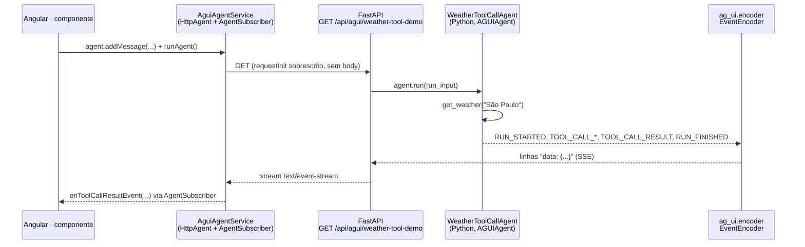

# Frontend AG-UI (issue #34) — HttpAgent + AgentSubscriber

> Como o Angular consome os eventos AG-UI emitidos pelo backend Python (#32, #33).

## Sequência de uma chamada

Exemplo real contra `GET /api/agui/weather-tool-demo`, do clique no Angular até o
resultado da tool call chegar no `AgentSubscriber`.



## Onde cada peça mora

Nada existente é tocado — `chat.service.ts` continua no protocolo SSE ad-hoc do
projeto (`text_delta`/`tool_call`/`tool_result`/`done`/`error`). O AG-UI ganha
seus próprios arquivos, isolados.

| Camada | Arquivo | Status |
|---|---|---|
| Angular · `apps/frontend` | `core/services/chat.service.ts` | ✅ já existe — não mexe (protocolo ad-hoc) |
| Angular · `apps/frontend` | `core/services/agui-agent.service.ts` | 🔜 issue #34 — subclasse de `HttpAgent` + `AgentSubscriber` |
| Python · `apps/backend` | `app/agui/agent.py` | ✅ #32/#33 — `AGUIAgent`, `WeatherChatAgent`, `WeatherToolCallAgent` |
| Python · `apps/backend` | `app/api/routes/agui.py` | ✅ #32/#33 — `GET /agui/demo`, `GET /agui/weather-tool-demo` |

## O ajuste necessário: GET em vez de POST

Confirmado lendo `node_modules/@ag-ui/client/dist/index.mjs` — o método
`requestInit()` do `HttpAgent` é `protected`, feito de propósito para ser
sobrescrito ("Override this to customize the request").

**Default do SDK** — sempre POST, sempre manda o `RunAgentInput` inteiro como
corpo JSON:

```js
// dist/index.mjs — comportamento default do HttpAgent
requestInit(input) {
  return {
    method: 'POST',
    headers: { ...this.headers, 'Content-Type': 'application/json', Accept: 'text/event-stream' },
    body: JSON.stringify(input),
    signal: this.abortController.signal,
  };
}
```

**Nossas rotas** — GET, sem corpo, sem LLM real por trás ainda (#32/#33 são
demos didáticas, sem transporte de mensagens do usuário).

**Solução** — subclasse local de `HttpAgent`, sobrescrevendo só
`requestInit()` para devolver `method: 'GET'` sem `body`. Nenhuma mudança no
backend é necessária.

---
Ver também: [diagrama do backend](backend-agui-agent.md) · [doc da issue #34](../issues-plans/34-Front-ag-ui-http-agent.md)
