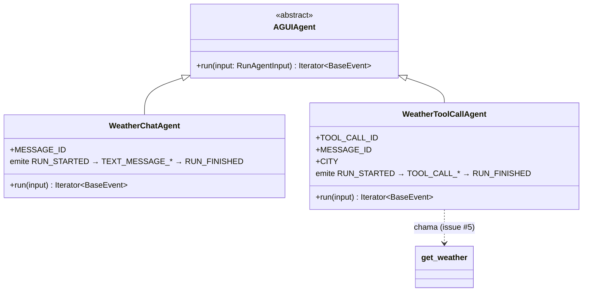
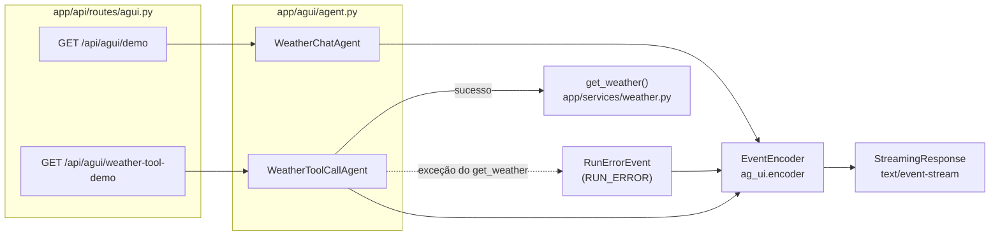

# Backend AG-UI (issues #32, #33) — como o agente Python funciona

> Arquitetura da implementação Python do protocolo AG-UI, decidida na issue #32
> em vez de replicar o SDK TypeScript do artigo original — ver
> [`32-Back-ag-ui-agent-skeleton.md`](../issues-plans/32-Back-ag-ui-agent-skeleton.md)
> para a justificativa completa.

## Hierarquia de classes

`AGUIAgent` é o equivalente Python ao `AbstractAgent` do SDK TypeScript: uma
classe abstrata com um único método, `run()`, que devolve um generator
síncrono de eventos AG-UI (`Iterator[BaseEvent]`) em vez de um
`Observable<BaseEvent>` do RxJS.

## Da requisição HTTP ao SSE

O tratamento de erro (`RunErrorEvent`/`RUN_ERROR`) foi adicionado na issue #33
depois de observar, testando manualmente sem uma `WEATHER_API_KEY` válida, que
o stream simplesmente cortava sem sinalizar falha ao cliente — ver notas em
[`33-Back-a2ui-weather-tool-call.md`](../issues-plans/33-Back-a2ui-weather-tool-call.md).

## Sequência de eventos por agente

| Agente | Rota | Sequência de eventos |
|---|---|---|
| `WeatherChatAgent` | `GET /api/agui/demo` | `RUN_STARTED` → `TEXT_MESSAGE_START` → `TEXT_MESSAGE_CONTENT` → `TEXT_MESSAGE_END` → `RUN_FINISHED` |
| `WeatherToolCallAgent` (sucesso) | `GET /api/agui/weather-tool-demo` | `RUN_STARTED` → `TOOL_CALL_START` → `TOOL_CALL_ARGS` → `TOOL_CALL_END` → `TOOL_CALL_RESULT` → `RUN_FINISHED` |
| `WeatherToolCallAgent` (falha do `get_weather`) | `GET /api/agui/weather-tool-demo` | `RUN_STARTED` → `TOOL_CALL_START` → `TOOL_CALL_ARGS` → `TOOL_CALL_END` → `RUN_ERROR` |

---
Ver também: [diagrama do frontend](34-front-agui-http-agent.md) · [doc da issue #32](../issues-plans/32-Back-ag-ui-agent-skeleton.md) · [doc da issue #33](../issues-plans/33-Back-a2ui-weather-tool-call.md)
